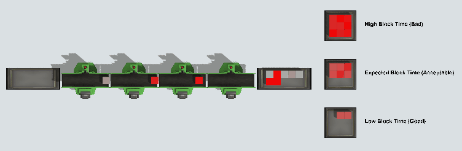
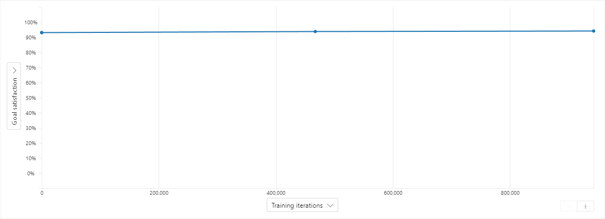
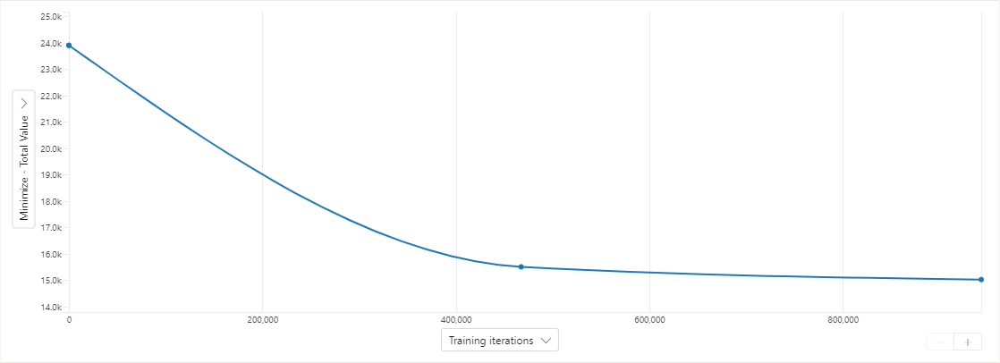
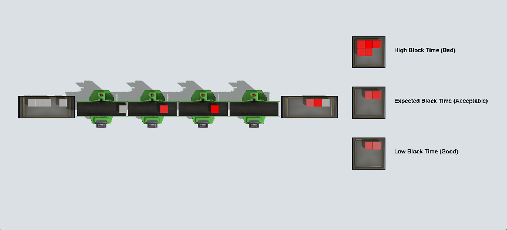
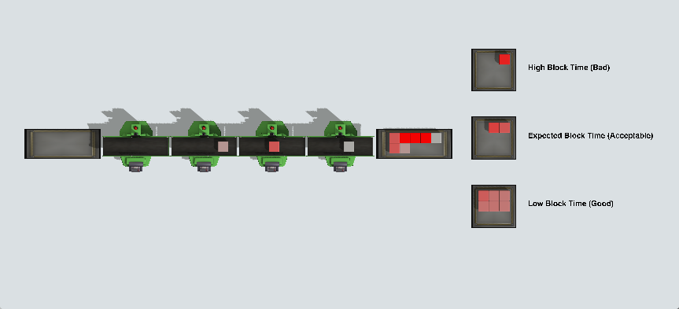

# Job Scheduling

## Model Description
The model is inspired by a sheet-metal production line. Items arrive at the beginning of the line
in batches of 10. Each item moves through the entire line. Only one item can be processed at a time
on each machine. So at most, there can only be four items in progress at any given time. A machine 
cannot accept a new item until the current item is accepted by the downstream machine.

The time required at each machine varies from item to item. Because of this, processing sequence
is central to system performance. A good sequence minimizes the time a machine spends waiting
for a downstream machine.

### Model Visualization
The color of each item represents how long it has been blocked by a downstream item. Items begin
as light gray. When an item is blocked, it fades more and more towards red. Once an item is 
finished, its color is an indicator of the total time is was blocked during processing.

After all ten items in the batch have been completed, the model creates a new item that
represents the batch as a whole. The batch item's color is the average color of all the
items in the batch. In addition, the batch item is placed in one of three queues, depending
on whether the average block time was high, acceptable, or low.

By running the model for a long time, you can see the effectiveness of the algorithm that
sequences items. The animation at the beginning of this article shows the result of choosing
items at random; most batches have a high block time, and very few end up with a low block
time.

## Brain Description

The Bonsai brain is designed to choose which item to process given the set of remaining
items in the batch. This decision happens whenever the first machine in the line
becomes available and there is more than one item remaining in the batch.

### Observations (SimState)

* **JobTimes** is a table with 10 rows and four columns. The value at row *i*, column *j* 
  indicates the time required by item *i* on machine *j*. The set of items shown in
  the table are the items that have not started processing yet. Any extra rows show
  zero for the time required for that item.
  
  This observation allows Bonsai to see what jobs are available and how long they
  will take at each machine.

* **WIPTimes** is an array with 6 values. These values are the times required by each
  of the three items in progress for their remaining steps. If less than three
  items are present, trailing values are set to zero.

  This observation allows Bonsai to see what's currently in progress.

* **BlockTime** is a single number. It records the total block time for all items
  since the previous observation. This value increases as items are blocked by other
  items in the line.

  This observation allows Bonsai to understand its effectiveness. The brain's goal is
  to minimize this value.

* **NextJobMask** is an array of values. It communicates which actions are valid. For
  example, if there are only 6 items left in the batch, then it would be invalid to
  attempt to choose items 7, 8, 9, or 10.

  > NextJobMask prohibits Bonsai from taking invalid actions, but is not included
  in the learning state.

### Actions

* **NextJob** represents the choice that Bonsai can make. The options for that choice
  start with *J1* and end with *J10*. If Bonsai chooses J2, that indicates that the
  second item of the remaining items should begin processing next.

### Using an Action Mask Concept

This brain contains two concepts. The first concept is called RemoveMask. Its purpose
is to reduce the input state by removing the NextJobMask observation. In order to
train the brain, you'll need to build this concept. Once the concept is built, you
can train.

### Goal

The goal of the brain is to minimize the BlockTime observation.

## Training

As training progresses, Bonsai gets better and better at choosing jobs. Usually, Bonsai can
become proficient after one million iterations.

### Goal Satisfaction

For each goal specified in the inkling file, Bonsai computes the ratio of iterations where the goal
was met compared to the total number of iterations. This value is called the Goal Satisfaction.

In this paticular example, the goal is to minimize the block time. The success threshold of the
goal is set to zero, meaning the goal is reached if there is no block time. However, due to random
nature of the process times required at each step, block time is unavoidable. Consequently, Bonsai
cannot always reach the goal, and Goal Satisfaction does not improve very much during training:

However, the total block time per episode decreases dramatically during training:

## Trained Brain Performance

You can see the difference between making random decisions and using Bonsai.
The following screenshots are the result of an experiment. Both screenshots
were taken at the exact same time in the model. The difference is that the model
in the top screenshot chose random tasks and the model in the bottom screenshot
used a trained Bonsai brain.

||
| :---: |
| Result using random decisions|

||
| :---: |
| Result using a trained Bonsai brain|

The following table summarizes the statistics visible in the two screenshots:

|  | Random | Bonsai |
| :---| ---: | ---: |
| High Block Time Batches | 5 | 1 |
| Low Block Time Batches | 2 | 6 |
| Total Completed Items | 93 | 97 |

As you can see, the trained brain has learned how to choose a good sequence of jobs
to improve production.

## Trying the Trained Brain for Yourself

The model in this example has a parameter called **ActionMode** that determines
how the model makes decisions. There are two options:
* Random - the model chooses items to process at random.
* Bonsai - the model chooses items to process using a bonsai brain.

To run the model and use the Bonsai brain, see the following steps. Note that the steps
assume you have [FlexSim](www.flexsim.com) installed, as well as 
[Docker Desktop](https://www.docker.com/products/docker-desktop/). The steps also assume
you already have access to a Bonsai workspace and that you have trained a brain for this
model, either by training the JobScheduling sample or by making your own brain and simulator.
If you do not have a workspace, see
[Getting Started with Bonsai](https://docs.flexsim.com/en/23.0/ModelLogic/ReinforcementLearning/WorkingWithBonsai/GettingStarted/GettingStarted.html#setup).

In the [Bonsai Interface](preview.bons.ai) in your browser:
1. Click on the brain that you have trained.
2. Click **Export Brain** button near the top-right corner.
3. Click the **Export** button to submit the request.
4. Wait several minutes for the brain to be exported. Once it is
   exported, you'll see it in the list of **Exported Brains** on
   the right.
5. Click the **...** button on the exported brain, and choose **View deployment instructions**
6. Be sure you are on the **ACR Download** tab of the deployment instructions window.
7. Run the given commands in a terminal. These commands download and run a container
   that makes the trained brain available as an HTTP service.

In FlexSim:
1. Open the model (JobScheduling.fsm).
2. In the **View** menu, choose **Toolbox** to open the Toolbox.
3. In the Toolbox, double click on the Parameter Table called **Parameters**
4. Double click on the Value column for the **ActionMode** parameter to reveal a combo box.
5. Change the ActionMode to **Bonsai**.
6. Reset and run the model.

